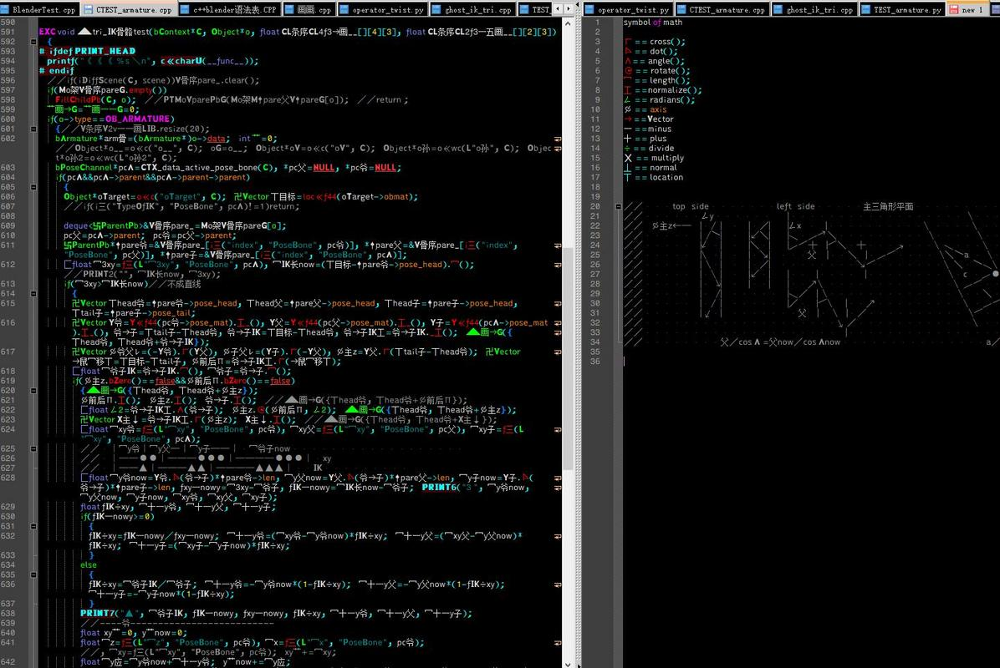

# Project 2
### Team: *filthy_acts_for_a_reasonable_price*
## Morse Code
### Introduction
Morse Code is a method of character encoding used in telecommunications that transforms text characters as a sequence of two different signals called *dots* and *dashes*.

The International Morse Code encodes the 26 English letters from `A` to `Z`, some non-English characters, the arabic numbers `0-9`, and a small set of punctuation signals. **There is no distinction between lower and upper case letters within the Morse code.**

### Problem
The problem established in this exercise has the following requirements:

* Transform the string given in Morse code to a decoded message.
* The input string has `1`'s and `0`'s representing the signals used in Morse code.
* One signal (*dot* or *dash*) is represented using units. One unit is equal to 2 values, e.g. One unit of 1 = 11 and one unit of 0 = 00. This is to make sure that the signal is not lost.
* The `1`'s are used to represent the *dots* and *dashes*, while the `0`'s are used to represent the spaces between parts of the letter, between letter, and between words.
* The length of one *dot* is one unit (`11`).
* The length of one *dash* is three units (`111111`).
* The length of the space between parts of the same letter is one unit (`00`).
* The length of the space between letters is three units (`000000`).
* The length of the space between words is seven units (`00000000000000`).

E.g.
```js
'HEY JUDE' == '1100110011001100000011000000111111001100111111001111110000000000000011001111110011111100111111000000110011001111110000001111110011001100000011'
```

With this information, the function decodes any messages "encrypted" in Morse code using the system described above.

### Solution
The function implemented comes with two checks to determine if the input string is correctly formatted and can be used to decode its hidden message.

The first check determines if there is any other character in the string that is different than the only two characters allowed: `1` and `0`. If the function finds that there's a different character, the input string is returned.

```js
if (input.match(/[^0-1]/g))
```

The second check determines if the input string has an even length, given that all the signals will be of units composed of two values. Like a *dot* would be a `11`. If it is not of even length, the input string is returned.

```js
if (input.length % 2 !== 0)
```

After both checks were confirmed to be false, a map with all the characters encoded is created to be used as reference when determining the value of a certain letter. The map consists of key-value pairs, where the key is the encoded letter, e.g. `1100111111`, and the value is the letter, e.g. `A`. 

```js
const ref = { // Morse code map
  '1100111111': 'A',
  '111111001100110011': 'B',
  '1111110011001111110011': 'C',
  // ...
}
```

We know that all words have to be separated by a sequence of 14 `0`'s, so a new array `words` is created to store all the words in the encoded message based on this. 

Once all the words are stored, the function now iterates over each word and over each letter to obtain the corresponding value of the letter, using the reference map established earlier. A new string using the decoded letters is returned.

## Fibonacci (BigInt)
### Introduction
In mathematics, the Fibonacci numbers form a sequence called the **Fibonacci sequence**, such that each number is the sum of the two preceding ones, starting from `0` to `1`.

Fibonacci numbers are strongly related to the **golden ratio**: **Binet's formula** expresses the *nth* Fibonacci number in terms of *n* and the golden ratio, and implies that the ratio of two consecutive Fibonacci numbers tends to the golden ratio as *n* increases.

### Problem
The problem expressed in this exercise has the following requirements:

* Construct a function that returns the Fibonacci number in the given *position*.
* The position is a natural number equal or greater than `0`.
* It is expected to receive large positions, e.g. get the *2000nth* Fibonacci number in the sequence.
* To be able to express large numbers, **JavaScript** offers a built-in object called **BigInt**, which allows the developer to represent whole numbers larger than 2<sup>53</sup>.

One example of how the function should behave is:

```js
fibonacci(2000) 
// should return 4224696333392304878706725602341482782579852840250681098010280137314308584370130707224123599639141511088446087538909603607640194711643596029271983312598737326253555802606991585915229492453904998722256795316982874482472992263901833716778060607011615497886719879858311468870876264597369086722884023654422295243347964480139515349562972087652656069529806499841977448720155612802665404554171717881930324025204312082516817125
```

### Solution
One of the main problems that had to be tackled in order to produce a solution to the exercise was to create an algorithm that was able to work with large quantities. The Internet is filled with Fibonacci algorithms, and many are based on a recursive solution, obtaining the Fibonacci sequence of the previous two numbers to the position given.

But this approach alone had to be worked a bit. This is because most of the algorithms created for this problem have a quadratic time complexity, or *O(n<sup>2</sup>)*. `n` representing the size of the input given to the algorithm. This means, that with a large enough input, the algorithm could take a great amount of time to be solved. Possibly hours. 

Since this is totally undesirable and inefficient, the algorithm was modified to be able to store the solutions of previous positions so that the function didn't have to recalculate them again each time a new larger position was used as input. These tweek resulted in a bigger space complexity for the algorithm, given the amount of memory that has to be consumed to store all the results up to a certain position, but the time complexity was reduced to *O(2n)*.

```js
return fibObj[position] = 
    BigInt(fibonacci(position - BigInt(1), fibObj)) +
    BigInt(fibonacci(position - BigInt(2), fibObj));
```

The piece of code of above is the one in charge of storing the results of positions previous to the one specified in the input using recursive calls. As one can notice, the code implements the `BigInt` object to be able to work with large numbers. `BigInt` cannot be used among other data types, so everything that comes in calculations with a `BigInt` has to be a `BigInt`.

## Kindergarden Sum
### Introduction
Normally, computers can solve operations like the sum of larges numbers in a frame of milliseconds, being able to give solutions to problems that would take minutes to a human. But still, everyone had to learn how to perform even the most basic operations: (`+, -, *, /`). 

When we learn how to sum two numbers with more than one digit, we are usuaylly taught to do it by adding up digit by digit with its counterpart. For example, adding up `4292` and `3177` would be solved by a kindergardener as follows:

1. Divide each number by its digits. `4292` would become `4 2 9 2`, and `3177` would become `3 1 7 7`. 
1. Sum each digit of the numbers, like so:

```js
    1
  4 2 9 2
+ 3 1 7 7
_________
  7 4 6 9
```
As we can see, when the sum of two digits results in a number greater than `9`, a remainder is added to the sum of the next sum of digits. In this case, `9 + 7` resulted in `16`, so we only write `6`, and the `1` is moved to the next sum `2 + 1 + 1`, resulting in `4`. 

### Problem
The problem is simple in this case. The function has to be able to perform the same procedure a `4` year old kid would follow to sum two numbers. The requirements are:

* Two inputs are given that are of type `string` that represent the numbers to be added.
* The result must be a `string` that represents the resulting number of the sum of the two inputs.
* The sum must be performed like when we were little kids.

```js
kSum('1914896', '789452');
// should result in '2704348'
```

### Solution
The solution that the team came up with works the following way:

1. Both strings are checked to have only numeric values from `0` to `9`. If not, both strings are returned in an array.
1. Both strings are transformed to arrays to be able to work with each digit individually.
1. A new array is created that contains the results of each individual sum, along with a variable that holds the remainder of a sum should the result be greater than `9`.
1. Within an iteration that starts at the end and stops before the first element of the input strings (arrays now), each digit is being added to the other with the inclusion of the variable that holds the remainder.
1. If the sum is greater than `9`, store a `1` in the `remainder`.
1. Store the result of the sum in the new array `sum`.
1. After the loop is over, add to the beginning of the `sum` array the sum of the first digits of both numbers plus the remainder and return it as a `string`.

# And now... a horror story...
